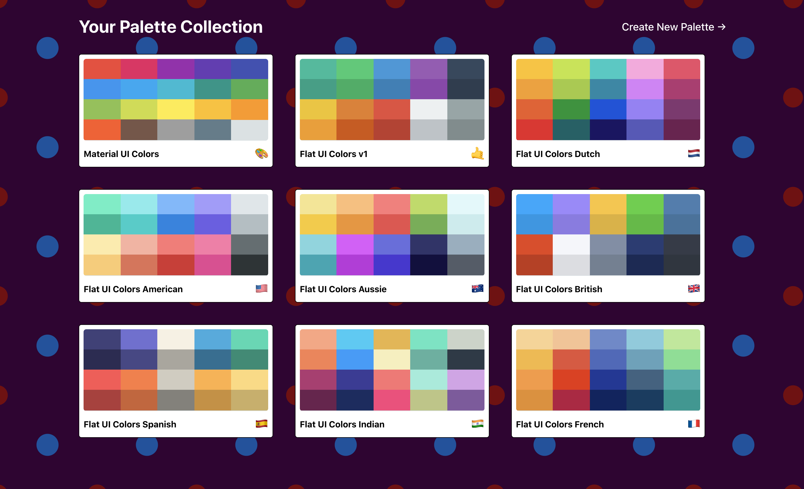
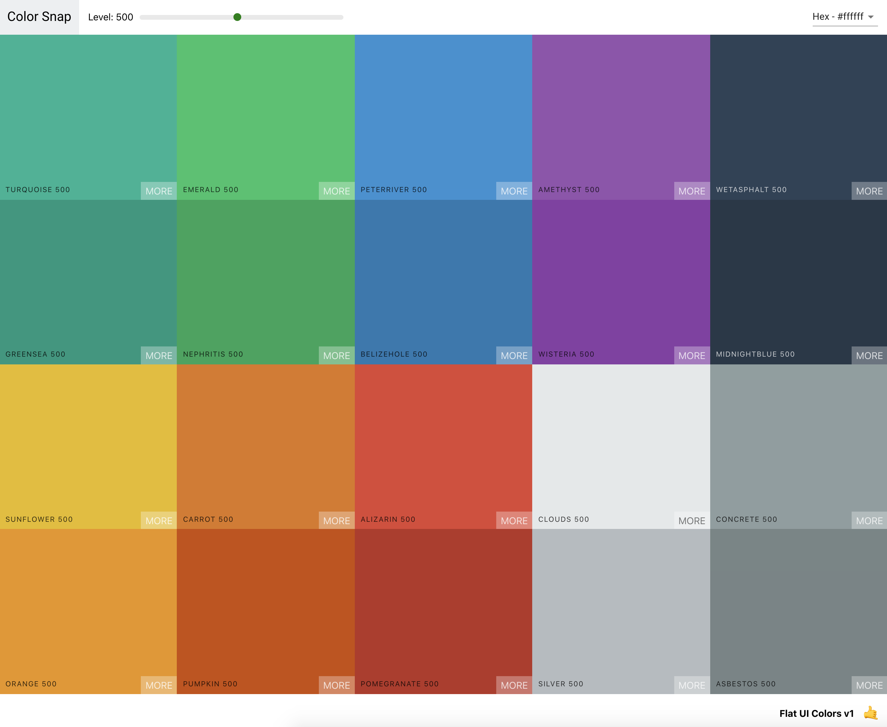
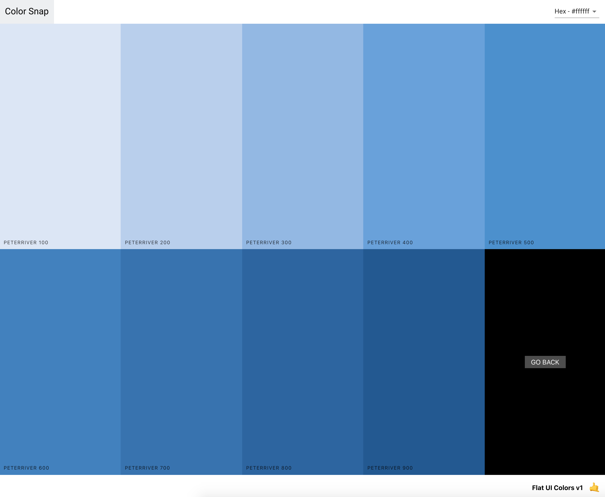
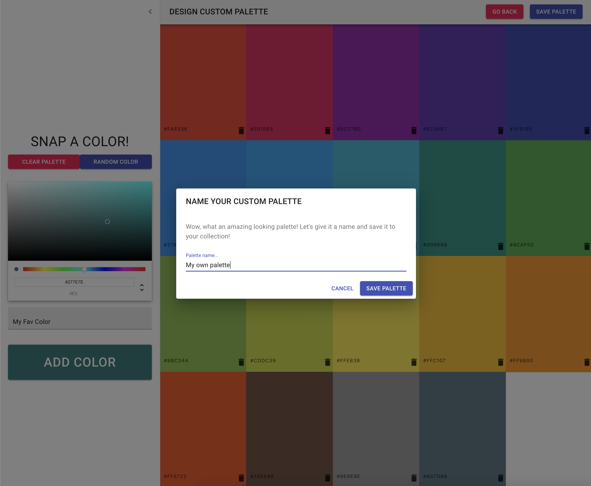

# React Color palette generator fronend project

## Helps develpors to come up with good color themes.

### Main technolodges: React, React Router, Hooks, Context, Material-UI.

---

**Current Features:**

- User is able to pick and copy color from 9 premade palettes.
- User is able to alter the alpha value of any color with a slider.
- User is able to make and store custom palettes of their liking.

---

[Live demo](https://hong-colorsnap.herokuapp.com/)

---

## SHOWCASE:

### Premade Palettes

### Picking a color from a Palette

### Picking from variations of a color

### Make a custom Palette

